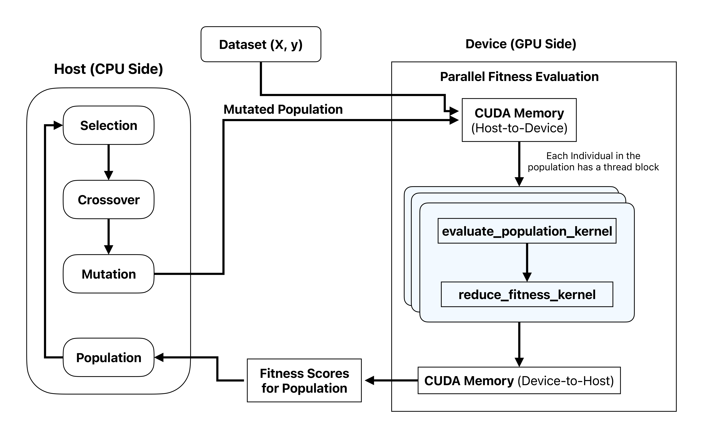
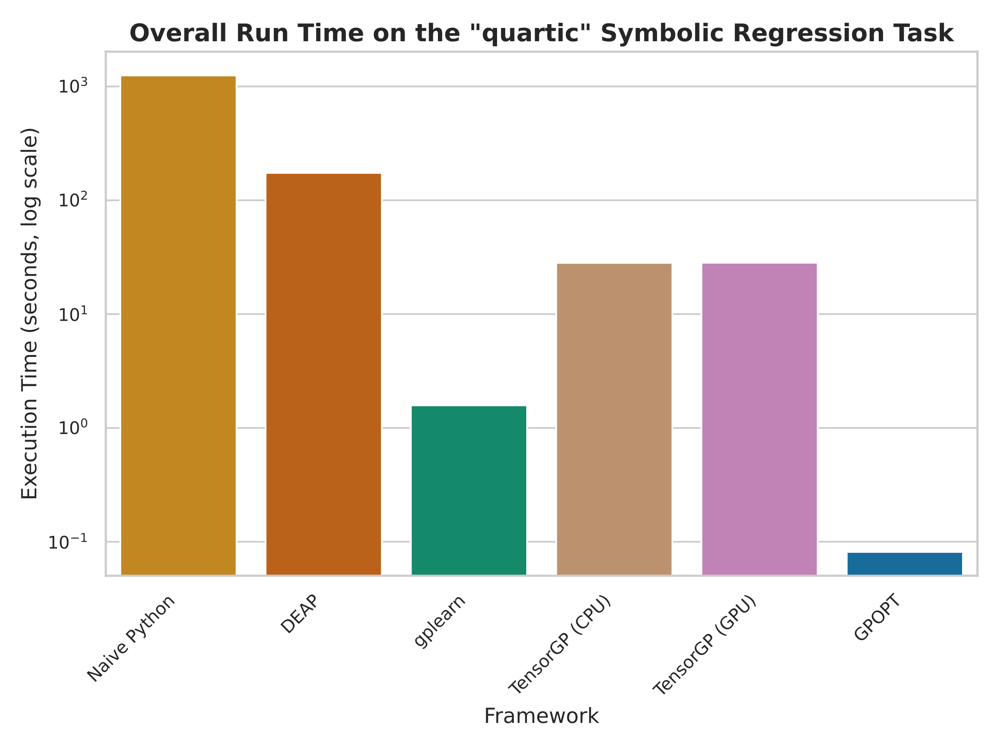
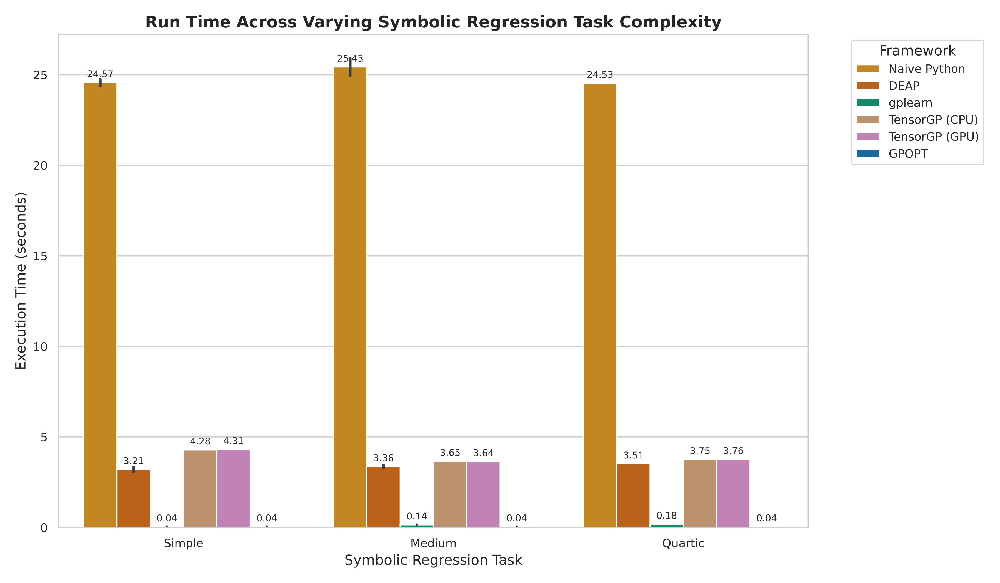
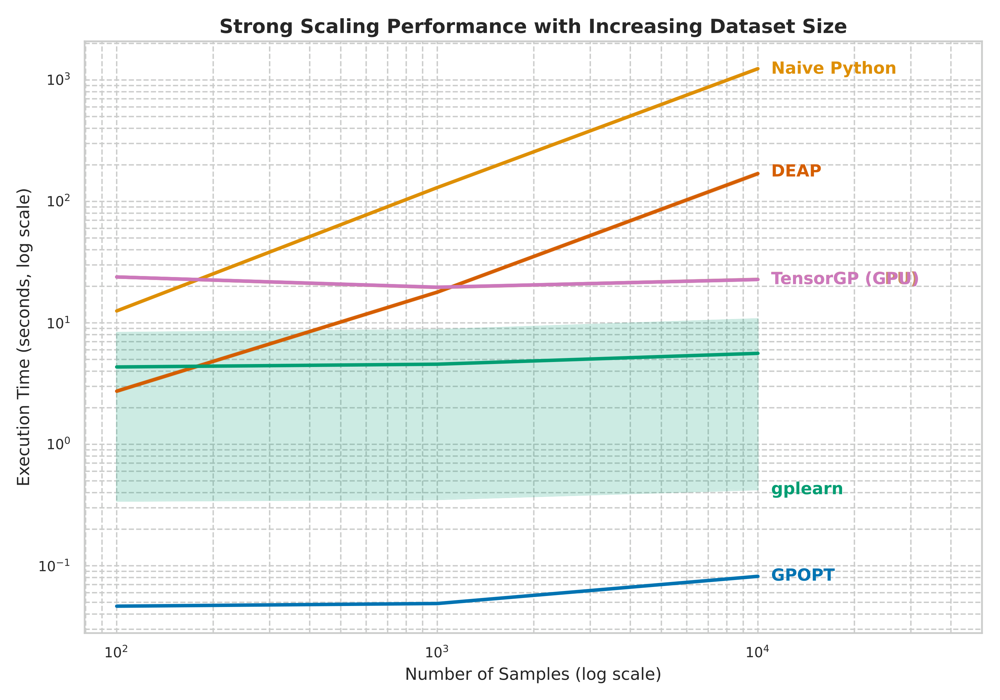
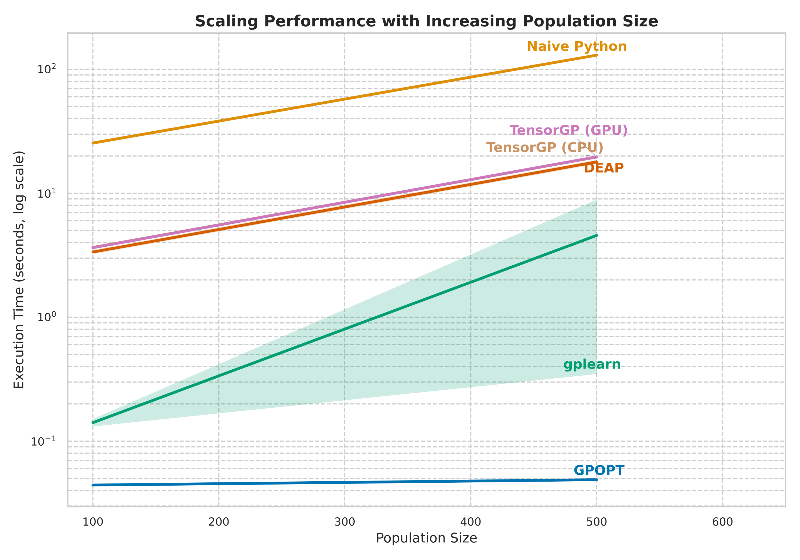
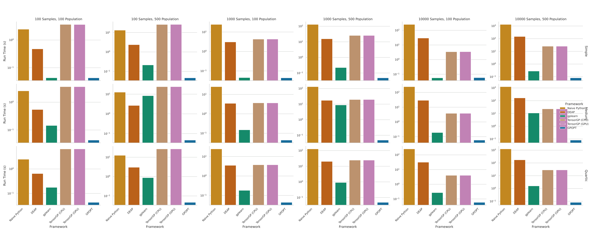

# GPOPT: A High-Performance Genetic Programming Framework using CUDA

GPOPT is a genetic programming (GP) framework designed for high-throughput computation, developed as a final project for the Massively Parallel Programming course. It leverages the massive parallelism of NVIDIA GPUs via a custom C++/CUDA backend to accelerate the most computationally intensive aspects of the GP workflow. The system provides a simple and expressive Python application programming interface (API), allowing users to tackle complex symbolic regression and optimization problems without sacrificing performance.

## Introduction
Genetic programming is an evolutionary computation technique that automatically generates computer programs to solve user-defined tasks. Its primary strength is its ability to explore a vast space of potential solutions without prior assumptions about the underlying model structure. This process, however, is computationally demanding. The fitness evaluation of thousands of candidate programs over many generations presents a significant bottleneck on traditional CPU-based systems.

GPOPT was developed to address this limitation directly. By identifying the fitness evaluation phase as an embarrassingly parallel problem, we offload this workload to a GPU. This architecture allows for the simultaneous evaluation of the entire population, reducing execution times from hours to seconds for large-scale problems and enabling a more thorough exploration of the solution space.

## Architecture
The GPOPT architecture is designed around a clear separation of concerns between the host (CPU) and the device (GPU), as illustrated in the block diagram below.



1. **Host (CPU)**: The high-level evolutionary algorithm logic resides on the host. This includes population management, selection, crossover, and mutation. The host orchestrates the overall evolutionary process, preparing data and managing the generational flow.

2. **Device (GPU)**: The device is dedicated to the parallel execution of the most computationally expensive task: fitness evaluation. A custom CUDA kernel, evaluate_population_kernel, is launched where each thread block is assigned to a single program in the population. This kernel utilizes shared memory to cache program data, minimizing global memory latency and maximizing throughput. A second kernel, reduce_fitness_kernel, performs a parallel reduction to calculate the final fitness score (Mean Squared Error) for each program.

This hybrid model ensures that the sequential, logic-heavy tasks are handled efficiently by the CPU, while the parallel, number-crunching tasks are accelerated by the GPU.

## Installation
GPOPT uses `scikit-build-core` and `CMake` to manage the C++/CUDA build process and create the Python bindings.

## Prerequisites
- A C++17 compliant compiler (e.g., GCC)
- NVIDIA CUDA Toolkit (version 12.x recommended)
- CMake (version 3.18 or higher)
- Python (version 3.8 or higher)
- pybind11

## Build Instructions
1. Clone the repository:
```bash
git clone https://github.com/iampaapa/gpopt.git
cd gpopt
```

2. Install Python dependencies and build the project:
The project can be built and installed directly using pip, which will handle the CMake build process automatically via the pyproject.toml configuration.
```bash
pip install .
```
This command compiles the C++/CUDA source, creates the Python bindings, and installs the gpopt package in your Python environment.

## Usage
The Python API provides a straightforward interface for configuring and executing a GP run. The following example demonstrates a typical workflow for a symbolic regression task.
```python
import gpopt
import numpy as np

# 1. Configure the GP parameters
config = gpopt.GpoptConfig()
config.population_size = 500
config.generations = 100
config.num_features = 2
config.num_samples = 1000
config.function_set = [gpopt.Op.ADD, gpopt.Op.SUB, gpopt.Op.MUL]

# 2. Initialize the GPOPT runner
runner = gpopt.GpoptRunner(config)

# 3. Prepare the dataset
# Example: y = x0 * x1 + 2*x1
X = np.random.rand(1000, 2).astype(np.float32)
y = (X[:, 0] * X[:, 1] + 2 * X[:, 1]).astype(np.float32)

# 4. Initialize the runner with data and execute the evolution
runner.initialize(X.flatten().tolist(), y.tolist())
runner.run()

# 5. Retrieve and inspect the best solution
best_solution = runner.get_best_individual()
print(f"Final Fitness (MSE): {best_solution.fitness}")
print(f"Best Program Found: {gpopt.format_program(best_solution)}")
```

## Performance Benchmarks
To validate the performance of GPOPT, a series of benchmarks were conducted against several established GP frameworks:

- Naive Python: A simple, single-threaded implementation serving as a baseline.
- DEAP: A popular and flexible CPU-based evolutionary computation library.
- gplearn: A widely-used scikit-learn compatible CPU-based GP library.
- TensorGP: A GPU-accelerated framework built on TensorFlow (tested on both CPU and GPU backends).

The benchmarks were run on symbolic regression tasks of varying complexity (simple, medium, quartic) and across multiple configurations of dataset size and population size.

## Key Results
The benchmark results demonstrate a significant performance advantage for GPOPT across all tested scenarios.

1. **Overall Performance**: On computationally demanding tasks, GPOPT is several orders of magnitude faster than the CPU-based frameworks and shows a considerable speedup over other GPU-accelerated solutions. The parallel architecture effectively mitigates the computational bottleneck of fitness evaluation.



2. **Scalability**: GPOPT exhibits superior scaling properties. As the dataset size or population size increases, the execution time for CPU-based frameworks grows substantially. GPOPT's run time, in contrast, shows a much smaller increase, highlighting the efficiency of the parallel implementation in handling larger workloads.



3. **Performance Across Configurations**: A detailed breakdown of performance across various tasks and configurations further confirms GPOPT's advantage. The framework maintains its lead regardless of the problem's structure or scale.


## Running the Benchmarks
The scripts used for the comparative analysis are located in the benchmarks/ directory. To replicate the results, you can execute the main runner script:
```bash
python benchmarks/run_benchmarks.py
```
This will run each framework against the predefined set of tasks and configurations, logging the results to `benchmark_results.csv`.

## License
This project is licensed under the MIT License.